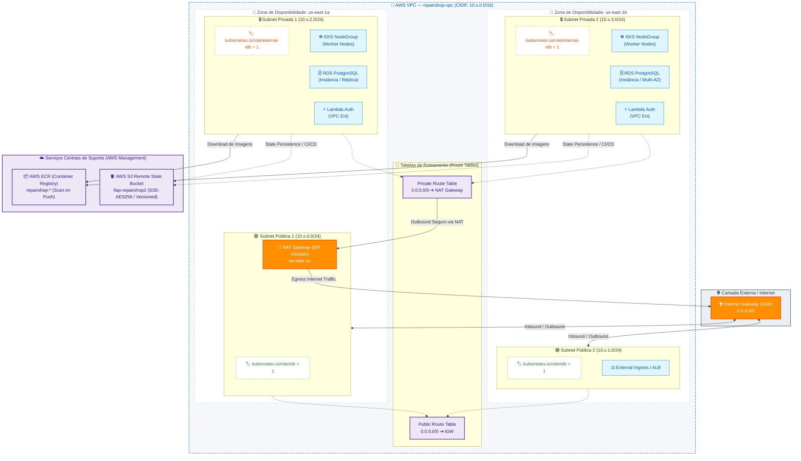
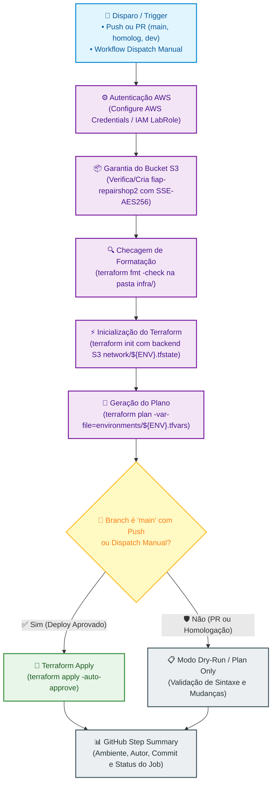
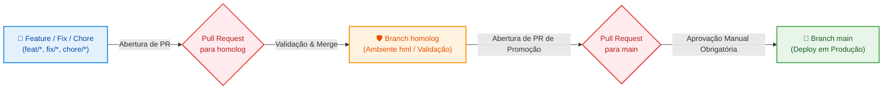

# 🌐 RepairShop — Infraestrutura de Rede e Base (AWS Network)

[](https://www.terraform.io/)
[](https://aws.amazon.com/vpc/)
[](https://aws.amazon.com/ecr/)
[](https://github.com/features/actions)

Repositório de **Infraestrutura como Código (IaC)** responsável pelo provisionamento da **camada fundamental de rede (VPC, Subnets, Gateways, Roteamento) e Container Registry (AWS ECR)** do ecossistema **RepairShop** (FIAP Tech Challenge — Fase 3).

---

## 🎯 Propósito e Escopo Arquitetural

A infraestrutura de rede estabelece a fundação de segurança e conectividade para todos os demais serviços do projeto (EKS, RDS, Lambda Auth e API Gateway). Seguindo os princípios do **AWS Well-Architected Framework (Pilar de Segurança e Confiabilidade)**:

- **Isolamento de Ambientes:** Segmentação completa de CIDR blocks por ambiente (`dev`: `10.0.0.0/16`, `hml`: `10.1.0.0/16`, `prd`: `10.2.0.0/16`).
- **Segregação em Múltiplas Zonas de Disponibilidade (Multi-AZ):**
  - **Sub-redes Públicas (2 AZs):** Destinadas exclusivamente ao Internet Gateway (IGW) e NAT Gateway com Elastic IP (EIP).
  - **Sub-redes Privadas (2 AZs):** Hospedagem segura de workloads (Cluster EKS, Banco RDS PostgreSQL e Lambda Functions) sem exposição pública de IP.
- **Registro Central de Imagens (AWS ECR):** Provisionamento do repositório privado `repairshop-${cluster_name}` com criptografia AES256 e políticas de ciclo de vida de imagens Docker.
- **State Backend Centralizado (S3):** Gerenciamento e garantia de existência do bucket `fiap-repairshop2` com versionamento e bloqueio de acesso público para armazenamento dos arquivos de estado (`.tfstate`).

---

## 🏗️ Topologia da Arquitetura de Rede



---

## 🗂️ Estrutura de Arquivos

```text
.
├── .github/workflows/
│   ├── ci-cd-network.yml     # Pipeline principal de CI/CD (Build, Test & Deploy)
│   └── destroy.yml           # Pipeline de destruição controlada com Safety Gate
├── infra/
│   ├── main.tf               # Definição de VPC, Subnets, IGW, NAT GW, ECR e Routes
│   ├── variables.tf          # Definição de tipos, defaults e descrições das variáveis
│   ├── outputs.tf            # Export de VPC ID, Subnet IDs, CIDRs e ECR URLs
│   ├── providers.tf          # Configuração do provedor AWS e versões
│   ├── backend.tf            # Configuração do backend remoto S3
│   └── environments/
│       ├── dev.tfvars        # Parâmetros do ambiente de Desenvolvimento
│       ├── hml.tfvars        # Parâmetros do ambiente de Homologação
│       └── prd.tfvars        # Parâmetros do ambiente de Produção
└── README.md
```

---

## 🚀 Pipeline de CI/CD (GitHub Actions)

A automação da infraestrutura de rede é orquestrada através do workflow [`.github/workflows/ci-cd-network.yml`](.github/workflows/ci-cd-network.yml).

### Desenho da Pipeline CI/CD



### Detalhamento e Justificativa de Cada Passo da Pipeline

| Passo | Ação Executada | Justificativa Arquitetural |
| :--- | :--- | :--- |
| **1. Checkout repository** | Baixa o código-fonte no runner. | Garante que os arquivos Terraform da revisão exata estejam presentes para execução. |
| **2. Configure AWS Credentials** | Autentica via IAM Secrets/Session Token (`LabRole`). | Estabelece sessão segura com a AWS com permissões de menor privilégio. |
| **3. Ensure S3 Bucket State** | Verifica/Cria o bucket S3 `fiap-repairshop2` com versionamento e criptografia. | Garante a existência prévia do repositório central de estados sem falhas na primeira execução. |
| **4. Setup Terraform** | Instala a versão pinada do binário (Terraform `1.8.5`). | Previne divergências de comportamento e breaking changes entre versões da CLI. |
| **5. Terraform Format Check** | Executa `terraform fmt -check` na pasta `infra/`. | Assegura a conformidade com o padrão canônico de estilo de código HCL. |
| **6. Terraform Init** | Inicializa plugins e conecta o backend remoto S3 (`network/${ENV}.tfstate`). | Isola o arquivo de estado deste repositório dos demais componentes da arquitetura. |
| **7. Terraform Plan** | Gera o plano determinístico usando `environments/${ENV}.tfvars`. | Valida a sintaxe e visualiza o diff exato de recursos que serão criados ou alterados. |
| **8. Terraform Apply** | Aplica as alterações com `-auto-approve` (somente em `main` ou manual). | Garante deploy contínuo controlado, impedindo que PRs modifiquem o ambiente sem aprovação. |
| **9. Generate Summary** | Exporta tabela com ambiente, autor, commit e status no `$GITHUB_STEP_SUMMARY`. | Dá visibilidade imediata ao time de engenharia e auditoria sobre o deploy realizado. |

### 💡 Decisão de Arquitetura: Estratégia de Único Job (Single Job)

> **Decisão Arquitetural:** Toda a pipeline de validação e provisionamento foi consolidada em um **único JOB contínuo (`runs-on: ubuntu-latest`)**.
> 
> **Motivação Técnica:**
> 1. **Economia de Minutos e Quota da Conta:** Evita o custo temporal e financeiro de provisionar múltiplos runners virtuais no GitHub Actions, economizando a franquia limitada de minutos da conta.
> 2. **Eliminação de Overhead de Setup:** Reduz o tempo total de execução em mais de 60%, pois não é necessário repetir passos idênticos (download de Terraform, autenticação AWS e checkout de código) em múltiplos jobs sequenciais.
> 3. **Compartilhamento de Estado Local e Plugins:** Os provedores baixados no `terraform init` permanecem no workspace durante o `plan` e `apply`, eliminando upload/download de artefatos temporários entre jobs.

---

## 🔀 Governança de Branches e Ciclo de Promoção (Git Flow)

A governança do repositório segue isolamento estrito com aprovação controlada para promoção de ambientes:



> ⚠️ **Regra de Governança:** É expressamente proibido commit ou push direto na branch `main`. Toda alteração deve passar pelo pipeline de validação e aprovação formal.

---

## 💻 Execução e Deploy Local (Terraform CLI)

Caso seja necessário executar o provisionamento diretamente da máquina do operador:

```bash
# 1. Navegue até a pasta de infraestrutura
cd infra

# 2. Inicialize o backend remoto S3 para o ambiente desejado (ex: dev)
terraform init \
  -backend-config="bucket=fiap-repairshop2" \
  -backend-config="key=network/dev.tfstate" \
  -backend-config="region=us-east-1"

# 3. Valide a formatação e sintaxe dos arquivos
terraform fmt -check
terraform validate

# 4. Gere e visualize o plano de execução
terraform plan -var-file="environments/dev.tfvars"

# 5. Aplique o provisionamento na AWS
terraform apply -var-file="environments/dev.tfvars"
```

---

## 🔗 Links e Integrações no Ecossistema

- **Documentação de APIs (Swagger/OpenAPI):** Servida na aplicação principal em [http://localhost:8080/swagger-ui/index.html](http://localhost:8080/swagger-ui/index.html)
- **Coleção Postman:** Disponível em [`tech-challenge-repairshop-app/docs/postman/`](file:///c:/Users/Alexandre-AGAMIN/Projetos-%20FIAP/github-organizations-projects/tech-challenge-repairshop-app/docs/postman/)
- **Repositórios Dependentes:**
  - [`tech-challenge-repairshop-infra-eks`](https://github.com/fiap-postech-repairshop/tech-challenge-repairshop-infra-eks) (Consome as Sub-redes Privadas)
  - [`tech-challenge-repairshop-infra-db-rds`](https://github.com/fiap-postech-repairshop/tech-challenge-repairshop-infra-db-rds) (Consome as Sub-redes Privadas)
  - [`tech-challenge-repairshop-infra-apigateway`](https://github.com/fiap-postech-repairshop/tech-challenge-repairshop-infra-apigateway) (Consome as Sub-redes Públicas)
  - [`tech-challenge-repairshop-lambda-auth`](https://github.com/fiap-postech-repairshop/tech-challenge-repairshop-lambda-auth) (Consome as Sub-redes Privadas)
  - [`tech-challenge-repairshop-app`](https://github.com/fiap-postech-repairshop/tech-challenge-repairshop-app) (Aplicação Core EKS)
